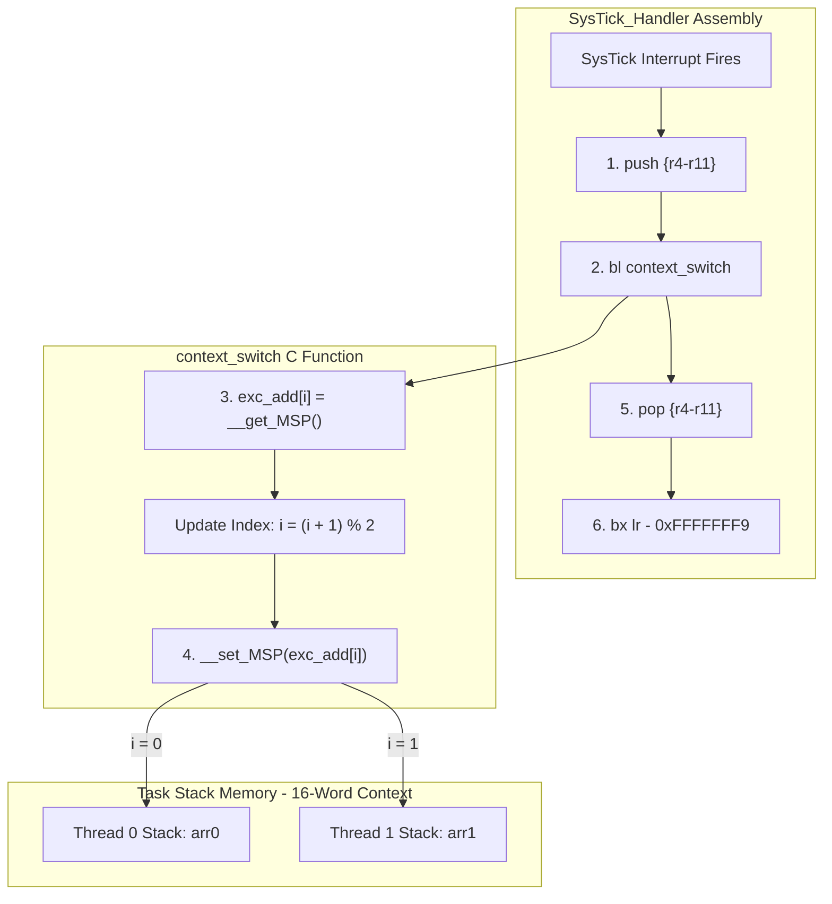

---

# Minimal RTOS Kernel — Version 1.0 (Full Context Preservation)

Version 1.0 upgrades the Version 0 proof-of-concept into a functional 2-thread preemptive time-slicing scheduler. It introduces full callee-saved register ($R4–R11$) context preservation and isolates thread execution onto dedicated RAM stack arrays (`arr0` and `arr1`).

---

## How It Works

### 1. Bootstrapping & Cold Launch
* **Thread 1 Setup (`fake_stack`)**: The scheduler manually initializes the stack for Thread 1 (`blinkoff`). `fake_stack()` sets `MSP = &arr1[60]` and pushes `xPSR` (`0x01000000`, Thumb mode) and `PC` (`&blinkoff`).
* **Manual Stack Offset Assignment**: The base stack address for Thread 1 is manually set to `exc_add[1] = &arr1[44]`. This 16-word offset (`60 - 16 = 44`) accounts for both the 8-word hardware frame ($R0–R3, R12, LR, PC, xPSR$) and the 8-word software frame ($R4–R11$).
* **Thread 0 Cold Start**: `main()` sets the active thread index `i = 0`, sets `MSP = &arr0[60]`, enables interrupts, and directly invokes `blinken()`. Thread 0 runs continuously until the first `SysTick` interrupt occurs.

### 2. Automated Preemptive Context Switching
Once the `SysTick` timer fires (100 Hz), the hardware and assembly scheduler automate context switching:

1. **Hardware Stack Push**: The Cortex-M CPU automatically pushes Thread 0's hardware frame ($R0–R3, R12, LR, PC, xPSR$) onto `arr0`.
2. **Software Stack Push**: `SysTick_Handler` (naked assembly) executes `push {r4-r11}` to save Thread 0's callee-saved registers onto `arr0`.
3. **Stack Pointer Swap**: `context_switch()` is called:
   * Saves Thread 0's updated stack pointer into `exc_add[0]`.
   * Toggles the active thread index: `i = (i + 1) % 2`.
   * Sets `MSP` to Thread 1's saved stack pointer (`exc_add[1]`).
4. **Software Stack Pop**: `SysTick_Handler` executes `pop {r4-r11}` to restore Thread 1's software context from `arr1`.
5. **Hardware Exception Return**: Executing `bx 0xFFFFFFF9` triggers the CPU to pop Thread 1's hardware frame ($R0–R3, R12, LR, PC, xPSR$) from `arr1` and jump to `blinkoff()`.

---

## Architecture Diagram

---

## Features

* **2-Thread Preemptive Scheduler**: Alternates execution between `blinken()` (Thread 0) and `blinkoff()` (Thread 1).
* **Full $R4–R11$ Context Preservation**: Software registers are explicitly saved and restored via `push {r4-r11}` and `pop {r4-r11}` in `SysTick_Handler`.
* **Isolated Task Stacks**: Thread 0 (`arr0[60]`) and Thread 1 (`arr1[60]`) execute on separate RAM stack buffers.
* **16-Word Context Frame Alignment**: Aligns the hardware frame (8 words) and software frame (8 words) so exception returns pop clean register values.

---

## Bugs & Architectural Issues (Targets for Version 2)

While Version 1 successfully switches context without crashing, it contains four architectural limitations that need to be addressed in Version 2:

### 1. Swapping Stack Pointers Inside a Normal C Function
Executing `__set_MSP()` inside `context_switch()` is compiler-dependent. If compiler optimization (`-O2` / `-O3`) pushes registers onto the stack at the start of `context_switch()`, changing `MSP` mid-function causes `context_switch()` to pop values off the **new thread's stack** upon return, risking memory corruption.
* *Fix for V2*: Perform the stack pointer swap entirely in pure Assembly or inside `PendSV_Handler`.

### 2. Uninitialized Software Frame ($R4–R11$) & Garbage $LR$
Setting `exc_add[1] = &arr1[44]` leaves indices `44–51` ($R4–R11$) and index `57` ($LR$) populated with raw RAM garbage on the first context switch. If Thread 1 ever exits its `while(1)` loop, $LR$ contains a random address, triggering a HardFault.
* *Fix for V2*: Programmatically initialize $R4–R11$ to zero and set $LR = 0xFFFFFFF9$ during initial stack setup.

### 3. Hardcoded Stack Offset (`&arr1[44]`)
Assigning `exc_add[1] = (uint32_t)&arr1[44]` relies on manual hardcoded index math (`60 - 16 = 44`). If stack sizes change or floating-point registers are added later, hardcoded indices break easily.
* *Fix for V2*: Create a programmatic stack initialization function using a struct or stack pointer decrement loop.

### 4. Lack of Process Stack Pointer (PSP) Task Isolation
Both tasks and interrupt handlers run on the Main Stack Pointer (`MSP`). If a task stack overflows, it directly corrupts the kernel exception stack.
* *Fix for V2*: Move user tasks to the Process Stack Pointer (`PSP`) and keep `MSP` reserved strictly for kernel exception handlers.
# Minimal RTOS Kernel — Version 0 (Proof of Concept)

Version 0 is the absolute bare-minimum proof-of-concept to get context switching working on an ARM Cortex-M4 (STM32F4). 

The goal here wasn't to write a production-ready scheduler, but to understand how the Cortex-M hardware exception frame works and manually manipulate the stack pointer to alternate execution between two functions.

---

## How It Works

1. **Memory Allocation**: Two static global arrays (`arr1[40]` and `arr2[40]`) act as raw stack buffers for two tasks (`blinken` and `blinkoff`). A 2-element array (`exc_add`) tracks the saved stack pointer (`MSP`) for each task.
2. **Bootstrapping (`fake_stack`)**: Before starting the scheduler, `fake_stack()` manually constructs a minimal Cortex-M hardware exception frame inside `arr1` by pushing `xPSR` (with the Thumb bit set) and the function pointer (`PC = &blinken`).
3. **Preemption & Switching**: 
   * The SysTick timer fires periodically (100 Hz).
   * Inside `SysTick_Handler`, it calls `context_switch()`.
   * `context_switch()` saves the current Main Stack Pointer (`MSP`) into `exc_add[i]`, updates the active index `i = (i + 1) % mx_thread`, loads the next thread's saved `MSP` from `exc_add[i]`, and returns using `EXC_RETURN` (`0xFFFFFFF9`).

---

## Architecture

---

## Features

* **Barely works with 2 lightweight threads**: Alternates execution between `blinken()` (LED ON) and `blinkoff()` (LED OFF).
* **Static Memory Allocation**: Uses static RAM arrays instead of heap/dynamic memory.
* **Basic SysTick Preemption**: Relies on SysTick interrupts to drive round-robin context switches.

---

## The 5 Biggest Bugs & Architectural Problems

While the LED blinks, Version 0 has severe architectural flaws that make it unusable for real applications. These are the main issues identified for future versions:

### 1. Missing Callee-Saved Register Handling ($R4–R11$)
The hardware exception entry automatically saves $R0–R3, R12, LR, PC,$ and $xPSR$. However, Version 0 **completely ignores $R4–R11$**. If local variables or loops inside `delay()` assign values to $R4–R11$, those registers get overwritten during a context switch, causing subtle data corruption when returning to the previous task.

### 2. Stack Pointer Pointing to Global RAM / Memory Corruption
In early iterations, setting `MSP` to global pointers (`&exc_add`) caused stack `push` operations to write directly into `.bss` RAM, overwriting surrounding global variables (`i` and `mx_thread`). Even with `arr1`/`arr2`, there is zero stack overflow protection, and changing `MSP` inside a normal C function (`context_switch()`) risks compiler-generated stack frame collisions.

### 3. Tasks Modifying Internal Scheduler State (`i`)
Both task functions (`blinken()` and `blinkoff()`) manually execute `i = 0;` and `i = 1;` inside their execution loops. Tasks should never touch private scheduler indices. This corrupts scheduler tracking and causes stack pointers to be saved into the wrong index of `exc_add[]`.

### 4. Uninitialized Hardware Exception Frame Registers
`fake_stack()` only pushes `xPSR` and `PC`, leaving $R0–R3, R12,$ and $LR$ as uninitialized garbage RAM values. If `blinken()` or `blinkoff()` ever returns or exits its infinite loop, $LR$ points to a random address, causing an instant HardFault.

### 5. Lack of Process Stack Pointer (PSP) Task Isolation
Running user tasks directly on the Main Stack Pointer (`MSP`) mixes interrupt exception frames with task execution stacks. Standard Cortex-M RTOS design requires tasks to run on the Process Stack Pointer (`PSP`) so kernel interrupts remain isolated on `MSP`. Using `MSP` for user tasks prevents stack protection and violates standard ARM exception return conventions (`EXC_RETURN` `0xFFFFFFFD`).