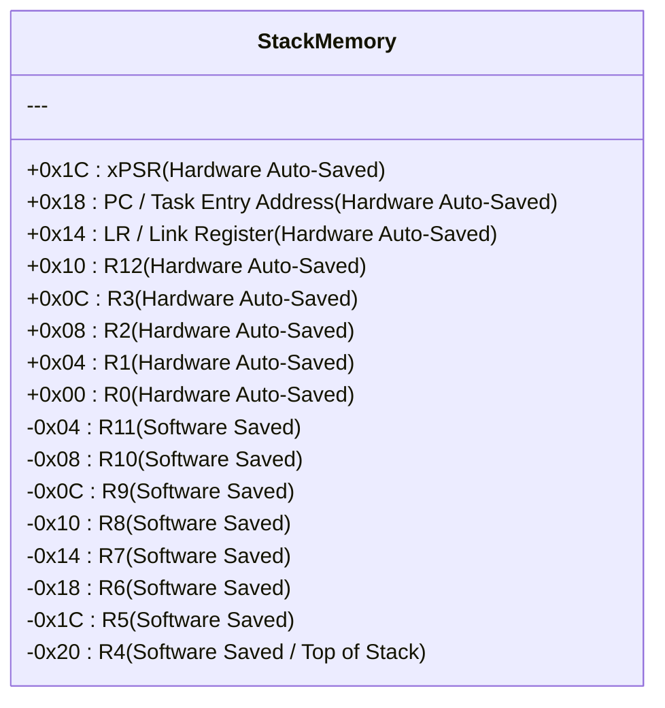
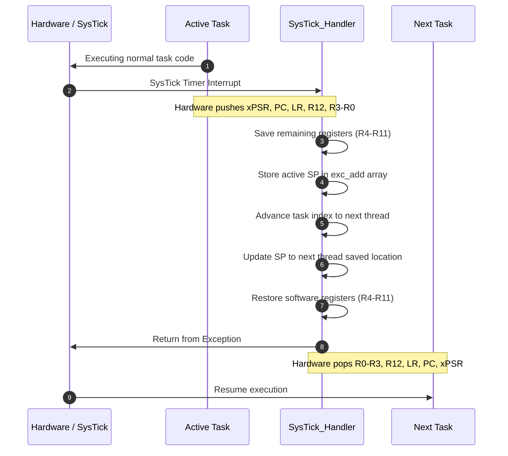
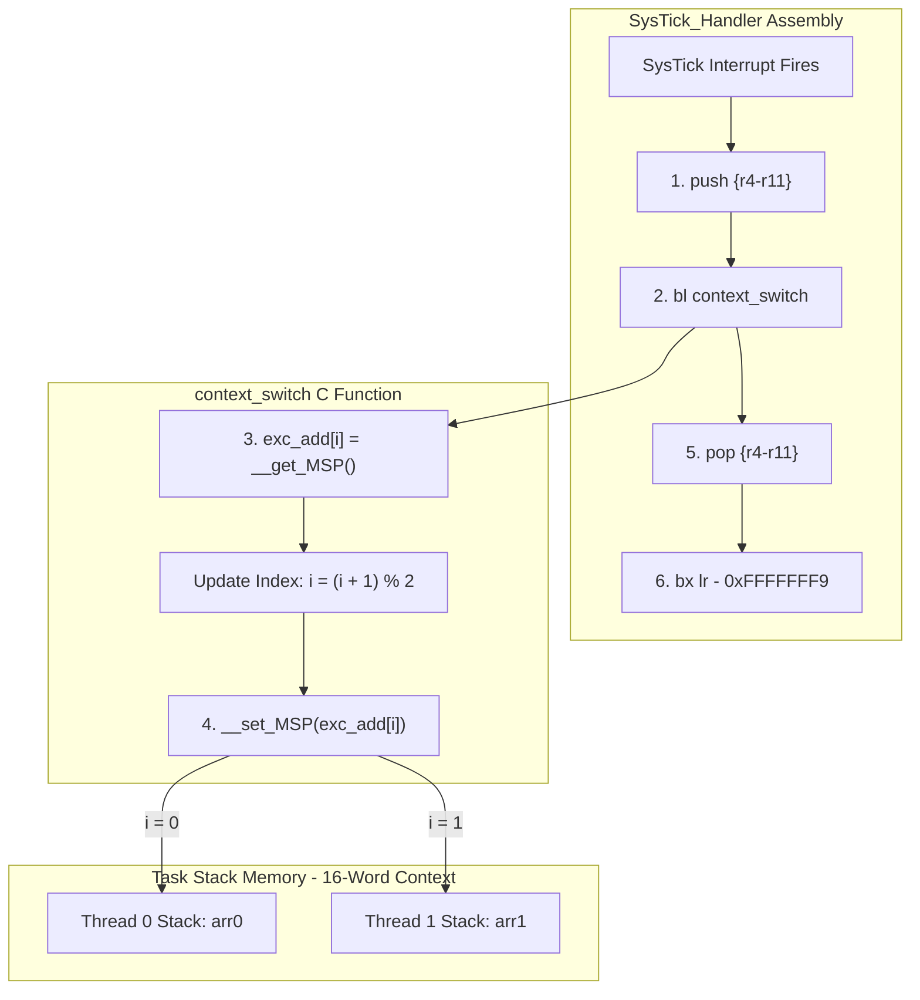
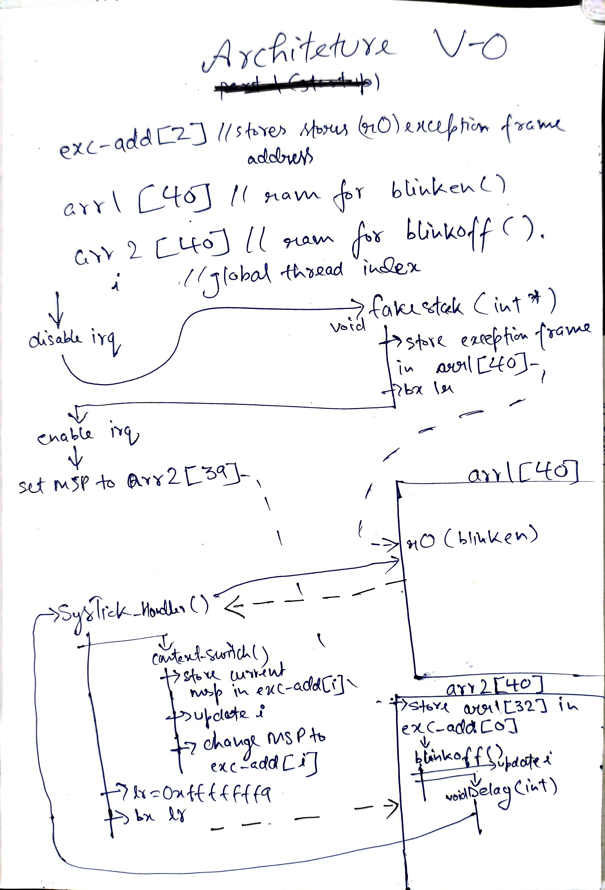

# Bare-Metal STM32F4 Cortex-M4 Preemptive Scheduler Engine

A custom, bare-metal preemptive round-robin task scheduler designed for ARM Cortex-M4 (STM32F4) microcontrollers. This repository documents the step-by-step evolutionary development of the kernel across three major versions—from a proof-of-concept hardware exception switcher (v0) to a full 5-thread assembly context-switching engine (v2).

---

## Table of Contents

- [Version 2 — Multi-Thread Assembly Kernel (Current)](#version-2--multi-thread-assembly-kernel-current)
  - [Architecture Overview](#architecture-overview)
  - [Thread Specifications](#thread-specifications)
  - [Detailed Architectural Upgrades over V1](#detailed-architectural-upgrades-over-v1)
  - [Architecture Diagrams](#architecture-diagrams)
  - [Project File Structure](#project-file-structure)
  - [Known Bugs & Design Issues](#known-bugs--design-issues)
- [Version 1.0 — Minimal RTOS Kernel](#version-10--minimal-rtos-kernel-full-context-preservation)
  - [How It Works](#how-it-works)
  - [Architecture Diagram](#architecture-diagram)
  - [Features](#features)
  - [Bugs & Architectural Issues](#bugs--architectural-issues-targets-for-version-2)
- [Version 0 — Proof of Concept](#version-0--minimal-rtos-kernel-proof-of-concept)
  - [How It Works](#how-it-works-1)
  - [Architecture](#architecture)
  - [The 5 Biggest Bugs & Architectural Problems](#the-5-biggest-bugs--architectural-problems)

---

# Version 2 — Multi-Thread Assembly Kernel (Current)

Version 2 is a custom, bare-metal preemptive round-robin task scheduler built for ARM Cortex-M4 (STM32F4) microcontrollers. The system uses the Cortex-M SysTick timer to perform context switching across multiple independent tasks.

## Architecture Overview

The system manages 5 statically allocated threads executing in a round-robin cycle:

- **Target MCU**: STM32F4 Series (100 MHz System Clock via HSE & PLL)
- **Scheduler Core**: Preemptive Round-Robin via `SysTick_Handler`
- **Time Slice**: 10 ms per thread (SysTick running at 100 Hz)
- **Context Preservation**: Hardware auto-stacking combined with manual software register saving (`R4–R11`)

---

## Thread Specifications

| Thread ID | Entry Function | Memory Stack | Action |
| :--- | :--- | :--- | :--- |
| **0** | `blue()` | `mem_alloc[0]` | Controls LED on PC13 and sends UART message |
| **1** | `green()` | `mem_alloc[1]` | Sends UART message |
| **2** | `red()` | `mem_alloc[2]` | Sends UART message |
| **3** | `yellow()` | `mem_alloc[3]` | Sends UART message |
| **4** | `white()` | `mem_alloc[4]` | Sets LED alias state and sends UART message |

---

## Detailed Architectural Upgrades over V1

### 1. Pure Assembly Context Switcher
* **Version 1 (Hybrid Approach)**: `SysTick_Handler` pushed software registers (`r4-r11`) in assembly, then performed a branch link (`bl context_switch`) to call a C function. 
  * *Drawback*: Calling a C function inside an interrupt handler forces the compiler to insert procedure call overhead, altering stack offsets and risking register corruption.
* **Version 2 (Pure Assembly)**: The C function `context_switch` was completely eliminated. The MSP pointer read/write (`mrs`/`msr`), task index arithmetic (`add`, `cmp`, `it eq`), and array indexing (`lsl #2`) are handled entirely in assembly within `SysTick_Handler`.

### 2. Stack Synthesis & Elimination of Magic Offsets
* **Version 1 (Manual Stack Frame)**: `v1` only pushed `xPSR` and `PC` in `fake_stack()`. To account for the un-pushed registers (`r0–r3`, `r12`, `LR`, `r4–r11`), `main()` manually assigned the stack pointer using a hardcoded index:
  * `exc_add[i] = (uint32_t)&arr1[44];` (Manually offset by 16 words / 64 bytes).
* **Version 2 (Automated Frame Construction)**: `v2` expanded `fake_stack()` to push a complete fake context frame:
  1. **Hardware Frame**: `xPSR`, `PC`, `LR`, `R12`, `R3`, `R2`, `R1`, `R0`
  2. **Software Frame**: `R11`, `R10`, `R9`, `R8`, `R7`, `R6`, `R5`, `R4`

The initial stack address is then saved automatically using `__get_MSP()`, completely removing the need for hardcoded index math.

### 3. SysTick Priority Management (`SCB->SHP`)
In Version 2, the following configuration was added to `v2main.c`:

```c
SCB->SHP[11] = 0xFF; // Set SysTick priority to lowest level (0xFF)
```
* **Why this matters**: In Cortex-M RTOS design, the scheduler interrupt (SysTick / PendSV) **must** run at the lowest priority so that hardware interrupts (such as UART, SPI, or Timers) are never delayed by a context switch.

### 4. Telemetry and I/O Expansion
* **Version 1**: The application only blinked an LED via bit-banding (`blinken` vs `blinkoff`).
* **Version 2**: Integrated USART1 serial communication. Each of the 5 threads transmits its status over serial (`b0\r\n`, `g0\r\n`, `r0\r\n`, `y0\r\n`, `w0\r\n`), providing real-time visibility into scheduler behavior.

---

## Architecture Diagrams

### 1. Context Switch Stack Layout

When a context switch occurs, the ARM hardware automatically pushes 8 core registers. The SysTick handler then manually pushes 8 additional software registers onto the active stack.



### 2. Preemptive Scheduling Sequence



---

## Project File Structure

```text
.
├── delay.h       # Global definitions, array allocations, thread count limits, and function prototypes
├── delay.c       # Software busy-wait delay implementation
├── v2.c          # SysTick interrupt handler and individual task routines (blue, green, red, yellow, white)
└── v2main.c      # System initialization, clock configuration, task stack synthesis function, and main entry
```

---

## Known Bugs and Design Issues

- **Register Corruption during Initialization**: The stack setup process overwrites the register storing the task function address before saving it to the stack, leading to execution crashes.
- **Missing Return Instructions in Naked Functions**: The function synthesizing initial thread stacks is declared as naked but lacks assembly return instructions, causing memory fall-through after execution.
- **Stack Alignment Violation**: Stack pointer calculations result in 4-byte alignment rather than the mandatory 8-byte alignment required by ARM Procedure Call Standards.
- **Shared MSP Memory Architecture**: User tasks execute using the Main Stack Pointer rather than the dedicated Process Stack Pointer, mixing kernel interrupt stack memory with task execution stack memory.
- **Inadequate Stack Memory Sizing**: The allocated task stack array size is too small, creating a high risk of stack overflow when calling HAL driver functions.
- **Hardcoded Floating Point Exception Returns**: The exception return mask hardcodes execution back to standard thread mode using MSP, breaking compatibility if Floating Point hardware extensions are enabled.
- **Interrupt Disabling during I/O Operations**: Temporarily turning off global interrupts during UART transmission freezes the SysTick timer and halts real-time task switching.
- **Uncalibrated Timing Loop**: The software delay function relies on arbitrary loop counts that do not accurately represent real-time millisecond durations.

---

# Version 1.0 — Minimal RTOS Kernel (Full Context Preservation)

Version 1.0 upgrades the Version 0 proof-of-concept into a functional 2-thread preemptive time-slicing scheduler. It introduces full callee-saved register ($R4–R11$) context preservation and isolates thread execution onto dedicated RAM stack arrays (`arr0` and `arr1`).

---

## How It Works

### 1. Bootstrapping & Cold Launch
* **Thread 1 Setup (`fake_stack`)**: The scheduler manually initializes the stack for Thread 1 (`blinkoff`). `fake_stack()` sets `MSP = &arr1[60]` and pushes `xPSR` (`0x01000000`, Thumb mode) and `PC` (`&blinkoff`).
* **Manual Stack Offset Assignment**: The base stack address for Thread 1 is manually set to `exc_add[1] = &arr1[44]`. This 16-word offset (`60 - 16 = 44`) accounts for both the 8-word hardware frame ($R0–R3, R12, LR, PC, xPSR$) and the 8-word software frame ($R4–R11$).
* **Thread 0 Cold Start**: `main()` sets the active thread index `i = 0`, sets `MSP = &arr0[60]`, enables interrupts, and directly invokes `blinken()`. Thread 0 runs continuously until the first `SysTick` interrupt occurs.

### 2. Automated Preemptive Context Switching
Once the `SysTick` timer fires (100 Hz), the hardware and assembly scheduler automate context switching:

1. **Hardware Stack Push**: The Cortex-M CPU automatically pushes Thread 0's hardware frame ($R0–R3, R12, LR, PC, xPSR$) onto `arr0`.
2. **Software Stack Push**: `SysTick_Handler` (naked assembly) executes `push {r4-r11}` to save Thread 0's callee-saved registers onto `arr0`.
3. **Stack Pointer Swap**: `context_switch()` is called:
   * Saves Thread 0's updated stack pointer into `exc_add[0]`.
   * Toggles the active thread index: `i = (i + 1) % 2`.
   * Sets `MSP` to Thread 1's saved stack pointer (`exc_add[1]`).
4. **Software Stack Pop**: `SysTick_Handler` executes `pop {r4-r11}` to restore Thread 1's software context from `arr1`.
5. **Hardware Exception Return**: Executing `bx 0xFFFFFFF9` triggers the CPU to pop Thread 1's hardware frame ($R0–R3, R12, LR, PC, xPSR$) from `arr1` and jump to `blinkoff()`.

---

## Architecture Diagram



---

## Features

* **2-Thread Preemptive Scheduler**: Alternates execution between `blinken()` (Thread 0) and `blinkoff()` (Thread 1).
* **Full $R4–R11$ Context Preservation**: Software registers are explicitly saved and restored via `push {r4-r11}` and `pop {r4-r11}` in `SysTick_Handler`.
* **Isolated Task Stacks**: Thread 0 (`arr0[60]`) and Thread 1 (`arr1[60]`) execute on separate RAM stack buffers.
* **16-Word Context Frame Alignment**: Aligns the hardware frame (8 words) and software frame (8 words) so exception returns pop clean register values.

---

## Bugs & Architectural Issues (Targets for Version 2)

### 1. Swapping Stack Pointers Inside a Normal C Function
Executing `__set_MSP()` inside `context_switch()` is compiler-dependent. If compiler optimization (`-O2` / `-O3`) pushes registers onto the stack at the start of `context_switch()`, changing `MSP` mid-function causes `context_switch()` to pop values off the **new thread's stack** upon return, risking memory corruption.

### 2. Uninitialized Software Frame ($R4–R11$) & Garbage $LR$
Setting `exc_add[1] = &arr1[44]` leaves indices `44–51` ($R4–R11$) and index `57` ($LR$) populated with raw RAM garbage on the first context switch. If Thread 1 ever exits its `while(1)` loop, $LR$ contains a random address, triggering a HardFault.

### 3. Hardcoded Stack Offset (`&arr1[44]`)
Assigning `exc_add[1] = (uint32_t)&arr1[44]` relies on manual hardcoded index math (`60 - 16 = 44`). If stack sizes change or floating-point registers are added later, hardcoded indices break easily.

### 4. Lack of Process Stack Pointer (PSP) Task Isolation
Both tasks and interrupt handlers run on the Main Stack Pointer (`MSP`). If a task stack overflows, it directly corrupts the kernel exception stack.

---

# Version 0 — Minimal RTOS Kernel (Proof of Concept)

Version 0 is the absolute bare-minimum proof-of-concept to get context switching working on an ARM Cortex-M4 (STM32F4). 

The goal here wasn't to write a production-ready scheduler, but to understand how the Cortex-M hardware exception frame works and manually manipulate the stack pointer to alternate execution between two functions.

---

## How It Works

1. **Memory Allocation**: Two static global arrays (`arr1[40]` and `arr2[40]`) act as raw stack buffers for two tasks (`blinken` and `blinkoff`). A 2-element array (`exc_add`) tracks the saved stack pointer (`MSP`) for each task.
2. **Bootstrapping (`fake_stack`)**: Before starting the scheduler, `fake_stack()` manually constructs a minimal Cortex-M hardware exception frame inside `arr1` by pushing `xPSR` (with the Thumb bit set) and the function pointer (`PC = &blinken`).
3. **Preemption & Switching**: 
   * The SysTick timer fires periodically (100 Hz).
   * Inside `SysTick_Handler`, it calls `context_switch()`.
   * `context_switch()` saves the current Main Stack Pointer (`MSP`) into `exc_add[i]`, updates the active index `i = (i + 1) % mx_thread`, loads the next thread's saved `MSP` from `exc_add[i]`, and returns using `EXC_RETURN` (`0xFFFFFFF9`).

---

## Architecture



---

## Features

* **Barely works with 2 lightweight threads**: Alternates execution between `blinken()` (LED ON) and `blinkoff()` (LED OFF).
* **Static Memory Allocation**: Uses static RAM arrays instead of heap/dynamic memory.
* **Basic SysTick Preemption**: Relies on SysTick interrupts to drive round-robin context switches.

---

## The 5 Biggest Bugs & Architectural Problems

### 1. Missing Callee-Saved Register Handling ($R4–R11$)
The hardware exception entry automatically saves $R0–R3, R12, LR, PC,$ and $xPSR$. However, Version 0 **completely ignores $R4–R11$**. If local variables or loops inside `delay()` assign values to $R4–R11$, those registers get overwritten during a context switch, causing subtle data corruption when returning to the previous task.

### 2. Stack Pointer Pointing to Global RAM / Memory Corruption
In early iterations, setting `MSP` to global pointers (`&exc_add`) caused stack `push` operations to write directly into `.bss` RAM, overwriting surrounding global variables (`i` and `mx_thread`). Even with `arr1`/`arr2`, there is zero stack overflow protection, and changing `MSP` inside a normal C function (`context_switch()`) risks compiler-generated stack frame collisions.

### 3. Tasks Modifying Internal Scheduler State (`i`)
Both task functions (`blinken()` and `blinkoff()`) manually execute `i = 0;` and `i = 1;` inside their execution loops. Tasks should never touch private scheduler indices. This corrupts scheduler tracking and causes stack pointers to be saved into the wrong index of `exc_add[]`.

### 4. Uninitialized Hardware Exception Frame Registers
`fake_stack()` only pushes `xPSR` and `PC`, leaving $R0–R3, R12,$ and $LR$ as uninitialized garbage RAM values. If `blinken()` or `blinkoff()` ever returns or exits its infinite loop, $LR$ points to a random address, causing an instant HardFault.

### 5. Lack of Process Stack Pointer (PSP) Task Isolation
Running user tasks directly on the Main Stack Pointer (`MSP`) mixes interrupt exception frames with task execution stacks. Standard Cortex-M RTOS design requires tasks to run on the Process Stack Pointer (`PSP`) so kernel interrupts remain isolated on `MSP`. Using `MSP` for user tasks prevents stack protection and violates standard ARM exception return conventions (`EXC_RETURN` `0xFFFFFFFD`).